# Execution Context - How JavaScript runs your code

চলুন প্রথমে একটি বার্ড সাই ভিউ দেখে আসি জাভাস্ক্রিপ্ট কোড কিভাবে রান হয়। জাভাস্ক্রিপ্ট কোড এখন ব্রাউজার এবং টারমিনাল দুই জায়গায় রান হয়। টারমিনার ও রান হয় নোড জেএস এর জন্য আর ব্রাউজার তো জাভাস্ক্রিপ্ট এর রান টাইম ই।

আমরা জাভাস্ক্রিপ্ট কোড কম্পিউটারে দেখতে হলে জাভাস্ক্রিপ্ট কোডকে অবশ্যই মেশিন কোডে কনভার্ট করতে হয় কারন কম্পিউটার তো জাভাস্ক্রিপ্ট কোড বুঝে না। এই কনভার্ট টা করে ব্রাউজার ইঞ্জিন। বিভিন্ন ব্রাউজারের ইঞ্জিন গুলো হলোঃ-

- গুগুল ক্রোমের ইঞ্জিন হলো **V8** ইঞ্জিন,
- ফায়ারফক্স এর জন্য **স্পাইডার মাঙ্কি**,
- ইন্টারনেট এক্সপ্লোরার এর জন্য **চাকরা**,
- সাফারির জন্য **জাভাস্ক্রিপ্ট কোর**।

তাদের কাজ একটাই জাভাস্ক্রিপ্ট কোড কে মেশিন কোডে রুপান্তর করা। তারা বিভিন্ন ওয়েতে এই কাজ টা করে থাকে কিন্তু তারা সবাই `ES-6` রুল ফলো করে থাকে। এই হচ্ছে একটা বার্ড সাই বর্ননা কিভাবে জাভাস্ক্রিপ্ট কোড কম্পিউটারে রান হয়। যেহেতু আমারা ওয়েব অ্যাপ্লিকেশন ডেভেলোপার তাই আমাদের হার্ডওয়্যার কি হচ্ছে তা থেকে বেশি গুরুত্বপূর্ন হলো ব্রাউজারের ইঞ্জিন গুলো কিভাবে কোড কে মেশিন এ রুপান্তর করছে।
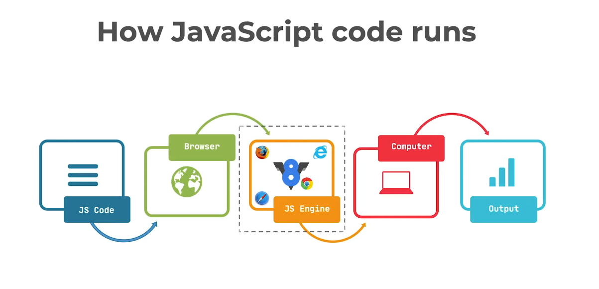
তবে এখানে একটি প্রশ্ন হতে পারে, তাহলে টার্মিনাল এ কিভাবে জাভাস্ক্রিপ্ট কোড কাজ করে? চলুন এই সম্পর্কে একটু জেনে আসি। **নোড জেএস** ক্রিয়েটর **Ryan Dahl** দেখেন জে জাভাস্ক্রিপ্ট কম্পাইলার তো বানানো আছে V8 ইঞ্জিন তিনি দেখলেন V8 হলো সবচেয়ে পারফোমেন্ট ইঞ্জিন এবং ওপেন সোর্স তাই সে V8 ইঞ্জিন C++ কোড এর সাথে তার নিজের C++ কোড প্রোগ্রাম অ্যাড করে তৈরি করে নেন **জাভাস্ক্রিপ্ট রান টাইম**। এখানে নোড জেএস কিন্তু কোনো আলাদা প্রোগ্রামিং ল্যাঙ্গুইয়েজ না, এটা জাস্ট জাভাস্ক্রিপ্ট রান টাইম। নোড জেএস এর কোর কিন্তু জাভাস্ক্রিপ্টই 😀।

## Interpretation vs Compilation

এই দুইটার কাজ একই আমাদের কোড কে মেশিন কোডে রুপান্তর করা, কিন্তু তাদের কাজের ধরন ভিন্ন। **Interpretation** কোড গুলো কে লাইন বাই লাইন এক্সিকিউট করে মেশিন কোডে রুপান্তর করে আর **Compilation** কোড গুলো কে একেবারে একসাথে সকল কোড গুলো এক্সিকিউট করে মেশিন কোডে রুপান্তর করে।
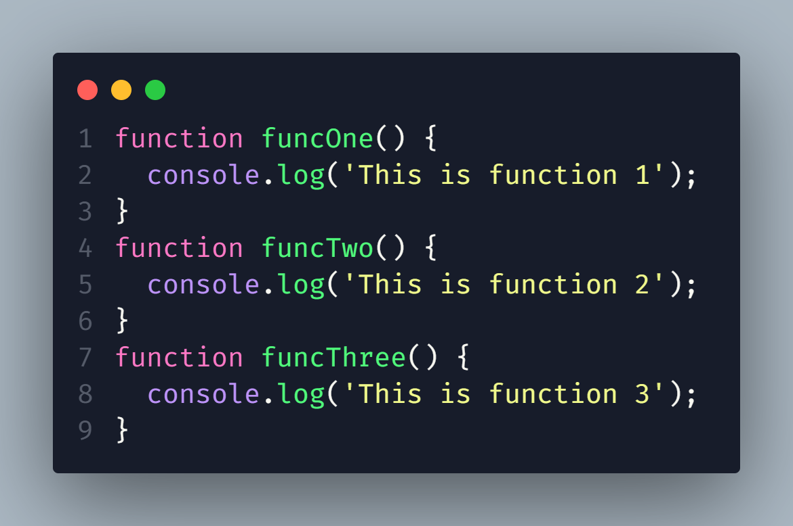
এটা হচ্ছে জাভাস্ক্রিপ্ট কোড যা আমরা বুজতে পারি। যাকে হাই লেভেল ল্যাঙ্গুইয়েজ ও বলে।
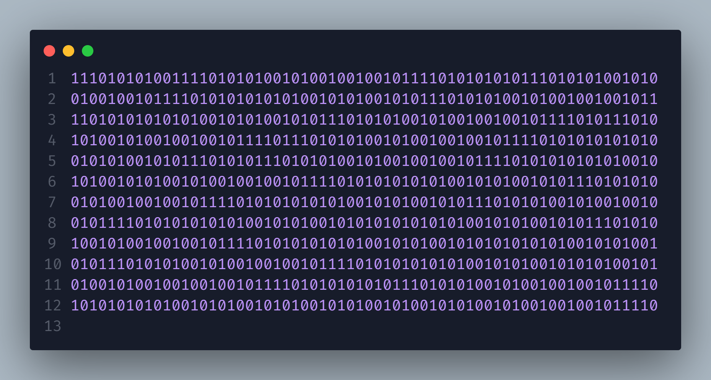
এটা হচ্ছে মেশিন কোড যা আমরা বুজতে পারি না কম্পিউটার বুঝতে পারে। যাকে লো লেভেল ল্যাঙ্গুইয়েজ ও বলে।

এখন এই কনভার্ট টা তিন ভাবে হতে পারে।

- Interpretataion
- Compilation
- Mixture of both

পূর্বে জাভাস্ক্রিপ্ট **Interpretataion** ওয়েতে মেশিন কোডে রুপান্তর হতো তাই অনেক স্লো ছিল। এখন জাভাস্ক্রিপ্ট Interpretataion অ্যান্ড Compilation এ Mixture of both ওয়েতে মেশিন কোডে রুপান্তর হয়। তাই এটা এখন যথেষ্ট ফাস্ট।

- Interpretation

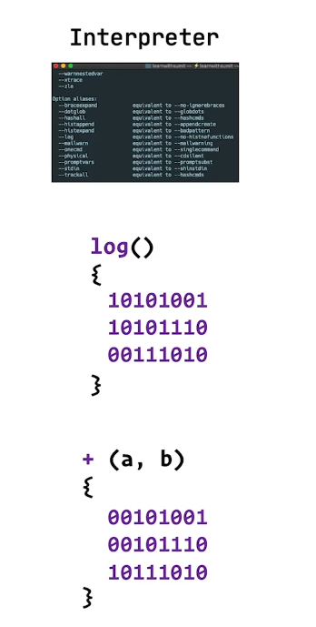

এই ওয়েতে আমরা যা ফাংশন কল করি ভেরিয়েবল নেই তাই জন্য একটা নির্দিষ্ট ইন্সট্রাকশন Interpretation এর কাছে থাকে। যখন এটা লাইন বাই লাইন ইন্সট্রাকশন অনুযায়ী রান করে। মনে করেন আমাদের ফাইল এ `console.log()` আছে এখন Interpretataion কি করে দেখে `log()` নামে তাই ইন্সট্রাকশন এ কিছু আছে কি না যদি থাকে তাকে রান করে দেয় আবার নিচের দিকে যায় আবার রান করে এতে করে Interpretataion একবার আমার কোডে আসে আবার তার নিজের ইন্সট্রাকশন এ যায় ফলে অনেক সময় লাগে সম্পূর্ণ কোড ব্লক টা রান হতে, এটা একটা সমস্যা ছিলো, কিন্তু এর একটা সুবিধা ও ছিলো তা হলো কোডে কোনো এরর পেলে সে সরাসরি এরর টা সো করতে পারতো।

- Compilation

**Compilation** কি করে আমাদের পুরো কোড টা কে একেবারে নিয়ে এবং মেশিন কোডে রুপান্তর করে ফেলে এবং তার পর _খেট খেট_ 🤣😁😂 করে লাইন বাই লাইন রান করে দেয় এইক্ষেত্রে প্রসেস টা অনেক ফাস্টার হয়, কিন্তু প্রবলেম হলো ধরুন আমার কোডে কোথায় ভুল ছিলো যার জন্য আমাদের অ্যাপ ক্রাশ করতে পারে কম্পাইলার কিন্তু থেমে থাকবে না এতে করে আমাদের কোড ডিবাগ করতে অনেক সময় লেগে যেতো।

এই সমস্যা থেকে বের হয়ে আশার জন্য গুগুল ২০০৮ সালে Compilation অ্যান্ড Interpretataion মিলিয়ে তৈরি করে তাদের V8 ইঞ্জিন যা ছিলো খুবই ফাস্ট এবং ইজি টু ডিবাগ কিন্তু রিয়েল কম্পাইলেশন এর মতো অত ফাস্ট না তবে মোর দ্যান এনাফ ছিলো।
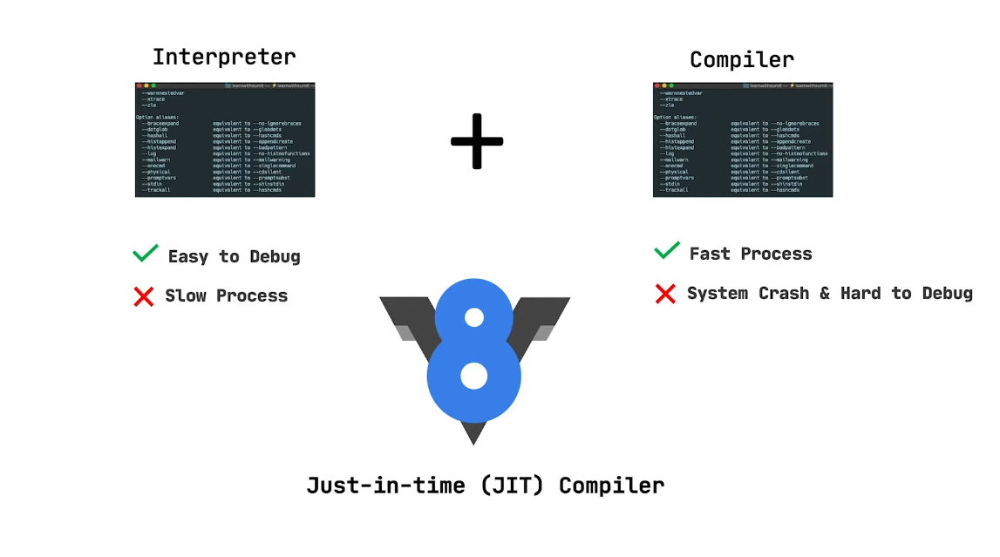

### How to work JIT Compiler

JIT হচ্ছে **Just in time compailer** যার JIT টা Interpretation এর কাজটা করে আর Compiler হচ্ছে মেশিন কোডে রুপান্তর করে। যখন আমরা কোনো ফাংশন ইনবোক করছি তখন সাথে সাথে Compiler মেশিন কোডে রুপান্তর করে ফেলে। আর যদি কোনো এরর পাই তাহলে JIT - just in time এর মধ্যে Compiler কে বলে থামো error here. তারপর আমরা এরর টাও দেখতে পাই। তাই এখন জাভাস্ক্রিপ্ট এবং নোড জেএস এতো ফাস্ট কারন এখন এগুলোতে JIT Compiler ব্যবহার করা হচ্ছে।

### Execution Context

অকে যখন জাভাস্ক্রিপ্ট ফাইল এ কোনো কোড থাকুক আর না থাকুক ইঞ্জিন এ একটি গ্লোবাল এক্সিকিউশন কন্টেক্স রান হয়, প্রথমেই একটা **লোয়েডিং ফেস** দিয়ে যায়। যেখানে,

- লোয়েডিং ফেস থাকে,
- window: global object থাকে,
- this.window দিস অই window কে পয়েন্ট করে রাখে,
- variable object থাকে
- scope chain থাকে
  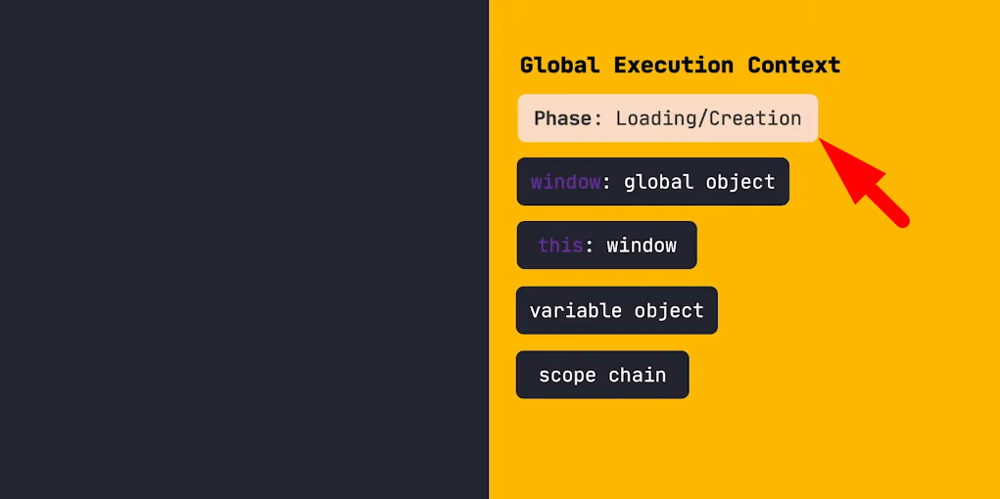
  এখন ধরুন নিচের মতো আমার ভেরিয়েবল নিয়ে একটা ফাংশন এ থাকে রিটার্ন করে আবার ফাংশন টা কল করলাম এখন চলুন দেখি এটা কিভাবে এক্সিকিউট হয়।
  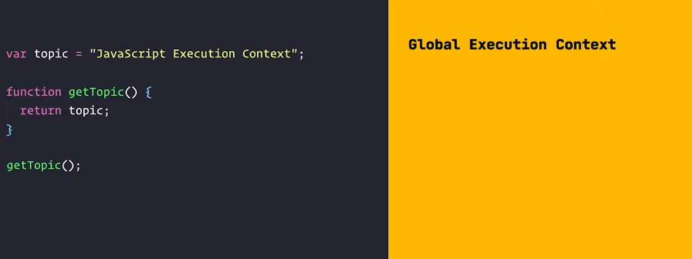
  দেখুন প্রথমেই পূর্বের মতো একটা লোয়েডিং ফেস দিয়ে যাবে এবং **Window:global object** তৈরি হবে যাকে **this** পয়েন্ট করে রাখবে।
  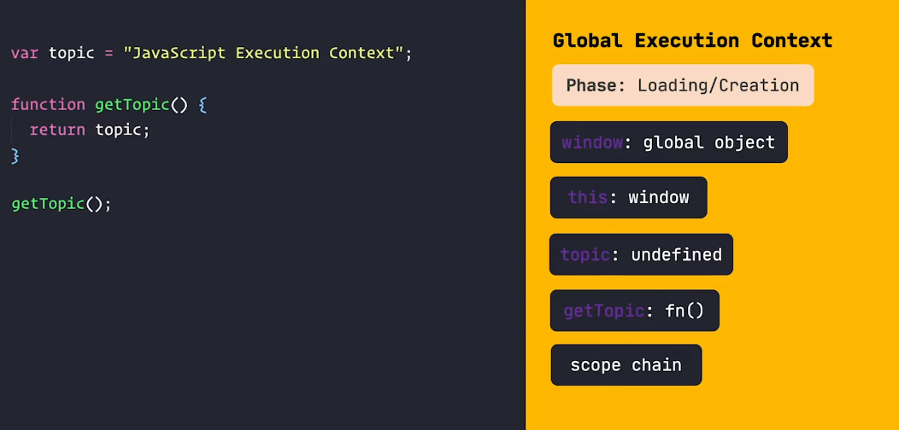
  এবার দেখুন **variable object** এর জায়গায় আমাদের ভেরিয়েবল **topic** টা আন্ডিফাইন্ড সেট হবে। তারপর **getTopic** ফাংশন ও **variable object** এ চলে যায় শুধু তার বডি টা একটি রেফারেন্স আকারে মেমোরিতে অ্যালোকেট হয়ে যায় যাতে করে পরে জাভাস্ক্রিপ্ট তাকে যেকোনো সময় আবার কল করতে পারে। আর সব স্কোপ গুলো এর গ্লোবার স্কোপ এ ঢুকিয়ে রাখে। এতোক্ষন যাবত চলল লোয়েডিং ফেস এখন হবে এক্সিকিউশন।
  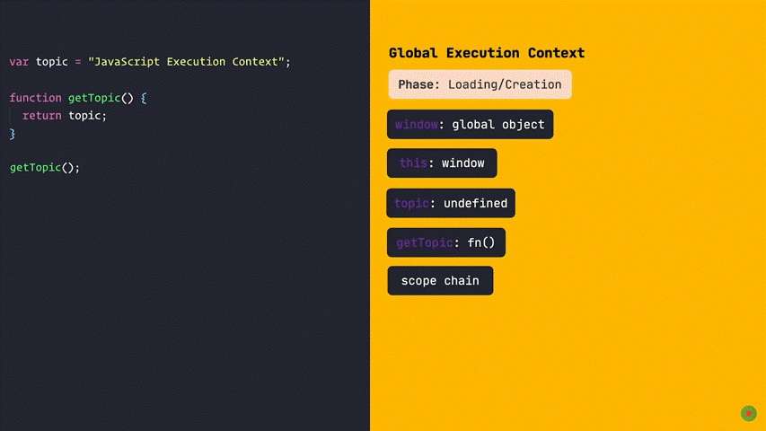
  খেয়াল করুন এক্সিকিউশন সময় **variable object** এ থাকা সকল **undefined** গুলোতে যার যার ভ্যালু দিয়ে অ্যাসাইন করে দিবে যদি স্ক্রিপ্ট ভ্যালু না থাকে তাহলে **undefined** থেকে যাবে। এখন দেখুন আমরা যদি কোডে সবার উপরে লিখি **console.log(topic)** তাহলে কি হচ্ছে আমরা কি ভ্যালু অ্যাসাইন করার পূর্বেই তাকে পেতে চাচ্ছি তাই তো কিন্তু আমরা কি দেখলাম Loading phase এ কিন্তু topic এর ভ্যালু undefined এখন ও কিন্তু ভ্যালু সেট হয় নি তাই তার আউটপুট আসবে undefined। আমরা যদি **var = topic** এর পর কন্সল করতাম তাহলে কিন্তু আমরা ভ্যালু সহ পাইতাম। এটায় হলো জাভাস্ক্রিপ্ট হোস্টিং, এখন বুঝতে পারবেন হোস্টিং মানে উপরের দিকে উঠানো নয় জেএস ইঞ্জিন প্রথমে সবাইকে **undefined** সেট করে দেয় তাকে আমরা বলেছিলাম যে ভেরিয়েবল গুলো উপরের দিকে উঠে যায় আশা করি এখন বুঝতে পারছেন। আমার লেখা হোস্টিং এর [আর্টিকেল](https://www.facebook.com/groups/learnwithsumit/permalink/1004907497493991/) টা পরতে পারেন।

### Function Execution Context

যখন গ্লোবাল কন্টেক্স রান হয় তখন কিন্তু ফাংশন কন্টেক্স রান হয় না, যখন ফাংশনকে ইনবোক করা হয় তখন ফাংশন কন্টেক্স রান হয় তখন গ্লোবাল কন্টেক্স এর মতো এটা ও লোয়েডিং ফেস দিয়ে তখন কিন্তু আবার গ্লোবাল এর মতো Global object সেট করে না এখানে ফাংশন তার কাছে আরগুমেন্ট নামে একটা অব্জেক্ট আছে তাকে সেট করে, ফাংশন বডি তে **console.log(arguments)** লিখে ফাংশন রান করলে দেখবেন একটা অব্জেক্ট পাচ্ছি, এখানে এটা কে সেট করে হয়। আর বাকি সব আগের মতো সেই হয় তবে এখানে ভেরিয়েবল ফাংশন সেট হবে ফাংশন এর দুনিয়ায় যদি কোনো ভেরিয়বল বা নেস্টেড ফাংশন থাকে এবং এই লোয়েডিং ফেস এ ভেরিয়েবক কে undefined and function কে রেফারেন্স আকারে মেমোরিতে অ্যালোকেট করবে, এখন জাভাস্ক্রিপ্ট কি সব কাজ এক সাথে করে, না চাইলে ও সে পারবে না কারন জাভাস্ক্রিপ্ট হলো সিংগেল থ্রেড ল্যাংগুয়েজ সে অ্যাট অ্যা টাইম একটাই কাজ করে যদি অনেক গুলো হয়ে যায় তাহলে সে একটা স্ট্যাক তৈরি করে এর কল স্ট্যাক নিয়ে একটু পরে কথা হবে।
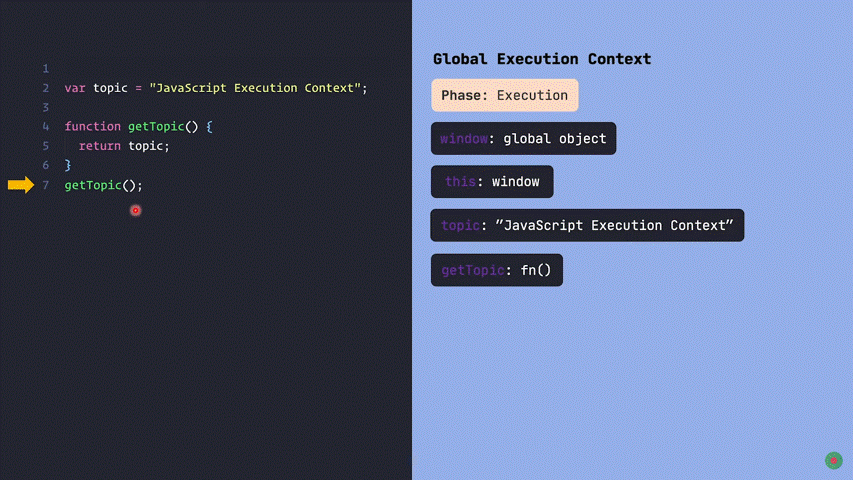
উপরের গিফটি লক্ষ্য করুন। এবার যখন ফাংশন এর লোয়েডিং ফেস এর প্রথমে সেট করে **arguments** যদি না থাকে তাহলে ফাঁকা অব্জেক্ট হয়ে যাবে এবং তার পর আশে এক্সিকিউশন ফেস তারপর যখন ফাংশন ইনবোক করা হবে তখন ফাংশন এর বডি তে যাবে যদি গিয়ে দেখে **return** তখন সাথে সাথে ফাংশন এক্সিকিউশন শেষ হয়ে যাবে।যদি রিটার্ন নাও লেখা হয় তবু ফাংশন থেকে undefined হলেও রিটার্ন হয়। আর যদি কিছু ইন্সট্রাকশন থাকে তাহলে সে করবে। আর কোনো কোড না থাকলে খুশি মনে এক্সিকিউশন এখানে শেষ হবে।

### How actual code run

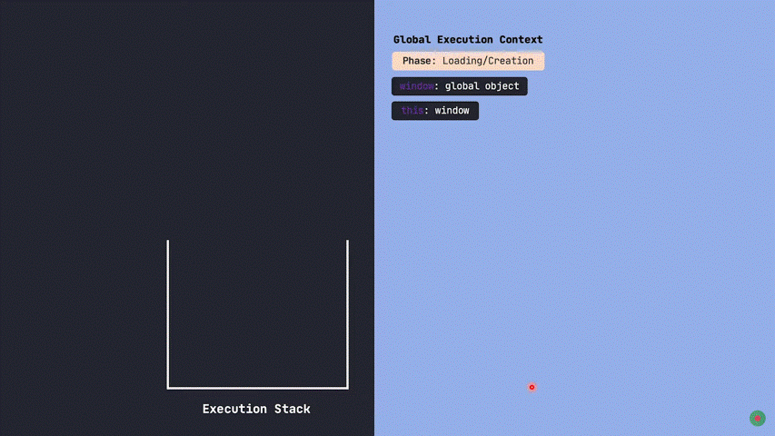

একদম শুরুতে যখন কোড থাকে না তখন থেকে গ্লোবাল অব্জেক্ট টা রান হয় তখন ক্ল স্টাক গ্লোবাল এক্সিকিউশন কন্টেক্স অ্যাড হয়। তারপর সেখানে লোয়েডিং ফেস চলে সেখানে কি হয় আগে বলে দিয়েছিলাম। গিফের কোড টি খেয়াল করুন। কোডে একটি ভেরিয়েবল আছে এবং একটা ফাংশন আছে **one()**, প্রথমে লোয়েডিং ফেস এ **var a = undefined** সেট হবে আর ফাংশন এর জন্য রেফারেন্স সেট হবে **one** নামে। তারপর যখন এক্সিকিউশন কন্টেক্স এ যাবে তখন **var = a** এর ভ্যালু 1 সেট হবে গিফ লক্ষ্য করুন। তারপর ফাংশন ফাংশনের জায়গায় থাকবে যখন ১৫ লাইনে ফাংশন কল হবে তখন কল স্টাক এ **one()** ফাংশন এর আরেকটি কন্টেক্স তৈরি হবে। এটি প্রথমে লোয়েডিং ফেস এ যাবে দেখবে যে কোনো আর্গুমেন্ট আছে কি না আমাদের কোডের ক্ষেত্রে নাই, তারপর দেখবে তার কোনো ভেরিয়েবল নাই, তারপর তার ভিতর **two()** টির রেফারেন্স অ্যাড হবে। এখন হবে **one()** ফাংশন এর এক্সিকিউশন প্রথমে আছে console.log(a) সে দেখবে তার স্পেস এ a আছে কি না যদি না থাকে তাহলে তার পেরেন্ট যাবে দেখবে যে আছে তারপর a মান প্রিন্ট করবে 1 । তারপর যাবে কডের ১৩ নং লাইনে যেখানে **two()** ফাংশন কে কল করা হয়েছে এখন কল স্টাক এ **two()** ফাংশন এর আরেকটি কন্টেক্স তৈরি হবে। এটি প্রথমে লোয়েডিং ফেস এ যাবে দেখবে যে কোনো আর্গুমেন্ট আছে কি না আমাদের কোডের ক্ষেত্রে নাই, তারপর দেখবে তার কোনো ভেরিয়েবল আছে কি না হ্যা আছে তা হলো b তার ভ্যালু সেট হবে undefined তার পর **three()** ফাংশন এর রেফারেন্স অ্যাড হবে এখন হবে **two()** এর এক্সিকিউশন প্রথমে আছে console.log(b) সে দেখবে তার স্পেস এ a আছে কি না হ্যা আছে কিন্তু ভ্যালু undefined তাই আউটপুট আসবে undefined এখানে বলে রাখি যদি var b = 2; কন্সোল এর উপরে হতো তাহলে আউটপুট আসতো 2। তারপর আবার 11 লাইনে ফাংশন **three()** কল আবার কল স্টাক এ আরেকটি কন্টেক্স অ্যাড হবে এটির ও প্রথমে লোয়েডিং ফেস এ যাবে যেহেতু এর আরগুমেন্ট আছে তাই প্রথমে আর্গুমেন্ট এর ভ্যালু সেট হবে তার পর ভেরিয়েবল var c = undefined সেট হবে তার পর **three()** ফাংশন টা এক্সিকিউশন এ যাবে তখন প্রথমে console.log(c+d) রান হবে এখন এখানে c ত undefined তাহলে কি হবে যেহেতু যোগ NaN আশার কথা কিন্তু না এখানে আসবে can not access before initilize কারনে এখানে c স্টোর করা আছে let এ আমরা জানি let একটু ব্যতিক্রম ভাবে কাজ করে। তাই এখাবে এমন এরর আসবে যদি এখন কন্সোল এর পূর্বে let c = 3 দিই তাহলে ঠিক ঠাক কাজ করবে। তারপর যেহেতু আর কোড নেই তাই **three()** বের হয়ে যাবে তারপর **two()** তারপর **one()** তারপর global object ও কল স্টাক থেকে বের হয়ে যাবে। এভাবে আমাদের কোড রান কমপ্লিটেড হয়ে যাবে। এখানে কল স্টাক এ কন্টেক্স গুলো অ্যাড হওয়া ও বের হবার সুন্দর একটা কথা আছে তা হলো lifo - last in first out অর্থাৎ যে সবার শেষে কল স্টাক এ যায় যে সবার আগে কল স্টাক থেকে বের হয়ে যাবে। এটাই কে বলে lifo.

### Discover Lexical Scope

উপরের কোড গুলো লক্ষ্য করুন। যদি আমার লেখা স্কোপ এর [আর্টিকেলটি](https://www.facebook.com/groups/learnwithsumit/permalink/1003981834253224/) না পরে থাকুন তাহলে দেখে আসতে পারেন। সেখানে কিছু কথা বলা হয়েছিল বোঝার সুবিধার জন্য। যেমন জাভাস্ক্রিপ্ট এ চাইল্ড পেরেন্ট এর সকল ডাটা ব্যবহার করতে পারে কিন্তু পেরেন্ট চাইল্ডের ডাটা অ্যাক্সেস পায় না চলুন এখন এক্সিকিউশন কন্টেক্স এর মাধ্যমে ভালো করে বুঝে আসি।

কোডে দেখুন একটা ফাংশন আছে তার ভিতরে একটা ভেরিয়েবল আছে var = msg; দিয়ে তারপর তাকে কল দিয়েছিলো তার পর কন্সোল লগ করা হয়েছে msg টিকে, তাহলে কি আমরা আউটপুট পাবো। চলুন দেখি কি হয় এক্সিকিউশন কন্টেক্স এর মাধ্যমে।

গিফ এ দেখুন প্রথমে গ্লোবাল অব্জেক্ট ক্রিয়েট হয় লোয়েডিং ফেজ এ ভেরিয়েবল নাই তাই কিছু হবে না তারপর ফাংশন আছে তার রেফারেন্স অ্যাড হবে তারপর ৫ নাম্বার লাইনে ফাংশন কল হয় তারপর আরেকটা ফাংশন কল স্টাক এ অ্যাড হবে এবার এখানেও লোয়েডিং ফেজ এ যাবে সেখানে আর্গুমেন্ট নাই ফাঁকা অব্জেক্ট সেট হবে তার পর তার নিজের ভেরিয়েবল msg কে undefined সেট হবে তার পর ফাংশন যখন এক্সিকিউশন এ যাবে তখন = এর কাজ হবে msg এ ভ্যালু সেট হবে। তার পর ফাংশন এর কার শেষ ফলে কল স্টাক থেকে ফাংশন বের হয়ে যাবে। তার পর কন্সোল লগ এ আসবে কিন্তু কল স্টাকে ত কোনো ভেরিয়েবল নাই। তাহলে প্রিন্ট হবে রেফারেন্স এরর। এখন বুঝতে পারছেন কিভাবে স্কোপটা কাজ করে।

### Discover Closure

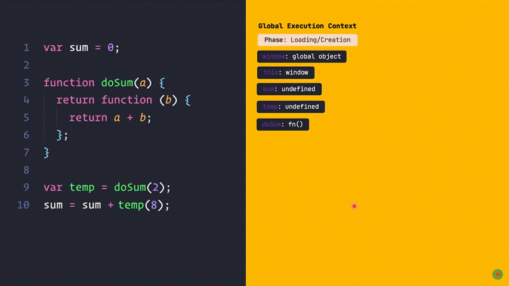

উপরের কোড গুলো লক্ষ্য করুন। যদি আমার লেখা ক্লোজার এর [আর্টিকেলটি](https://www.facebook.com/groups/learnwithsumit/permalink/1004493037535437/) না পরে থাকুন তাহলে দেখে আসতে পারেন। চলুন এখন এক্সিকিউশন কন্টেক্স এর মাধ্যমে ক্লোজার ভালো করে বুঝে আসি।

সবার প্রথমে গ্লোবাল কন্টেক্স যাবে কল স্টাক এ তারপর তার লোয়েডিং ফেস চলবে সেখানে প্রথমে **var sum = undefined** সেট হবে তার পর আবার দেখবে temp নামে আরেকটি ভেরিয়েবল তাকে ও undefind সেট করবে। তার পর দেখবে একটা ফাংশন **doSum()** তার রেফারেন্স ক্রিয়েট করবে। তার পর আসবে এক্সিকিউশন sum এর ভ্যালু সেট করবে তারপর ৯ লাইনে doSum() কল করা হয়েছে তাই আরেকটি কন্টেক্স কল স্টাক এ অ্যাড হবে এবার তার লোয়েডিং ফেস চলবে সেখান আর্গুমেন্ট এর ভ্যালু সেট হবে এবং a মান 2 সেট করবে তারপর আসবে তার এক্সিকিউশন পার্ট সে সেখান থেকে আরেকটি ফাংশন রিটার্ন করে দিবে তার ফাংশন বডি টা temp এ সেট হবে গিফ লক্ষ্য করুন। তারপরের লাইনে আবার temp(8) কল হবে আর হে এর আগে যেহেতু doSum() এর লোয়েডিং এবং এক্সিকিউশন শেষ তাই এটা কল স্টাক থেকে বের হয়ে যাবার কথা কিন্তু না যাবে না কারন হলো temp() ফাংশন এ return a + b অর্থাৎ a এর মান ব্যবহার করা হয়েছে আর doSum() থেকে আরেকটি ফাংশন রিটার্ন করেছে এতে করে এটা আবার কল হতে পারে তাই এই ফাংশন টা কল স্টাক এ থেকে যাবে ক্লোজার হয়ে। এখন যখন আবার temp() কল হয়েছে সাথে প্যারামিটার সহ তাই আর্গুমেন্ট এ b = 8 সেট করবে তারপর যাবে এক্সিকিউশন এ তখন দেখবে return a + b এখন b ত তার নিজের স্কোপ এ আছে । আর a এর মান টা সে ক্লোজার থেকে নিবে যোগ করে temp(8) ফাংশন এর মান ১০ সেট করবে তার পর sum এর সাথে যোগ হবে এবং sum এ আবার এর মান বসাবে sum = 0 + 10 এর রকম হবে দেখতে। তারপর sum সমান ১০ সেট হয়ে যাবে। তার পর temp() ফাংশন কল স্টাক থেকে বের হয়ে যাবে তারপর ক্লোজার ও চলে যাবে তারপর সবার শেষে কল স্টাক থেকে গ্লোবাল অব্জেক্ট ও চলে যাবে। এবং কোড রান শেষ হবে। 💘💘

ঠিক এভাবে জাভাস্ক্রিপ্ট কোড ব্রাউজারে রান হয়।
